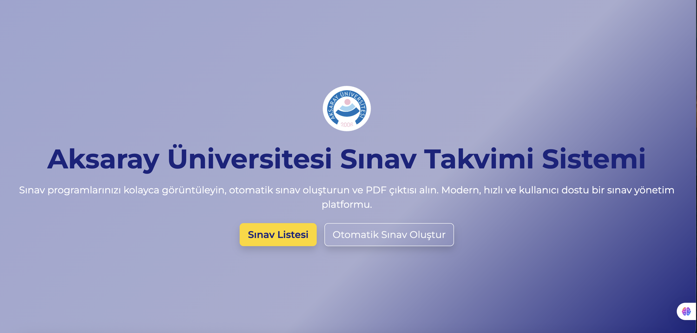
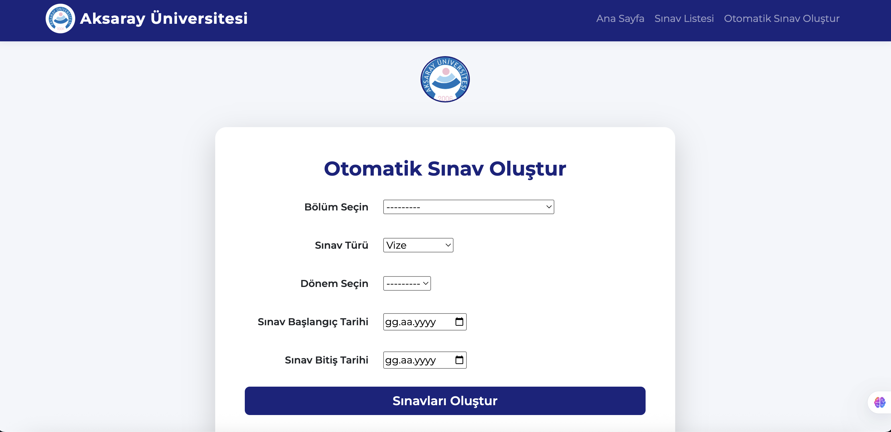
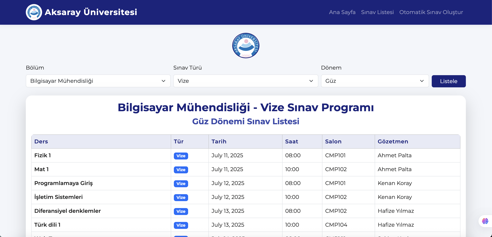

# Aksaray Üniversitesi Sınav Takvimi Sistemi

Bu proje, Aksaray Üniversitesi için modern, kullanıcı dostu ve işlevsel bir sınav takvimi yönetim sistemidir. Bölüm, sınav türü ve dönem bazında sınav programı oluşturabilir, sınav listelerini görüntüleyebilir ve PDF çıktısı alabilirsiniz.

## Özellikler
- **Ana Sayfa:** Modern ve bilgilendirici arayüz.
- **Otomatik Sınav Oluşturma:** Bölüm, sınav türü ve dönem seçerek otomatik sınav programı oluşturma.
- **Sınav Listesi:** Seçilen bölüm, tür ve döneme göre sınavları tablo halinde görüntüleme ve PDF çıktısı alma.
- **Kullanıcı Dostu:** Bootstrap 5 ile responsive ve şık tasarım.
- **Kolay Yönetim:** Django admin paneli ile bölüm, ders, gözetmen, salon ve dönem yönetimi.

## Kurulum

1. **Projeyi klonlayın:**
   ```bash
   git clone https://github.com/kullaniciadi/sinav-takvimi.git
   cd sinav-takvimi/sinav_takvimi
   ```
2. **Sanal ortamı oluşturun ve aktif edin:**
   ```bash
   python3 -m venv .venv
   source .venv/bin/activate
   ```
3. **Gerekli paketleri yükleyin:**
   ```bash
   pip install -r requirements.txt
   ```
4. **Veritabanı ayarlarını yapın ve migrate edin:**
   ```bash
   python manage.py migrate
   ```
5. **Admin kullanıcısı oluşturun:**
   ```bash
   python manage.py createsuperuser
   ```
6. **Sunucuyu başlatın:**
   ```bash
   python manage.py runserver
   ```
7. **Statik dosyaları toplayın (gerekirse):**
   ```bash
   python manage.py collectstatic
   ```

## Ekran Görüntüleri

### Ana Sayfa


### Otomatik Sınav Oluştur


### Sınav Listesi


## Kullanılan Teknolojiler
- Python 3
- Django 5
- Bootstrap 5
- HTML5, CSS3, JavaScript

## Katkıda Bulunma
Katkıda bulunmak isterseniz, lütfen bir fork oluşturun ve pull request gönderin.

